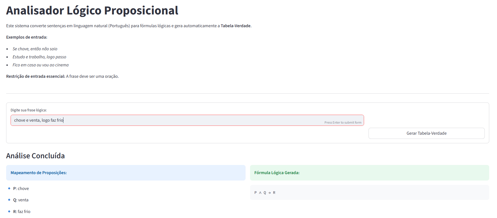
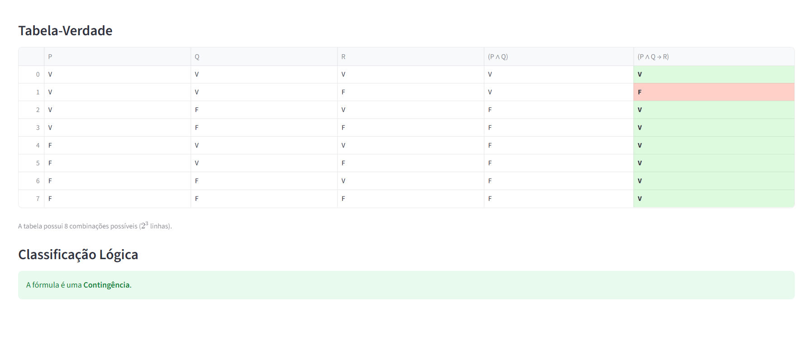

# Protótipo para análise de sentenças lógicas
Este protótipo é uma ferramenta interativa para análise e avaliação de expressões da lógica proposicional, desenvolvida como parte dos estudos na disciplina Lógica e Matemática Discreta, ministrada pelo Profº Rondineli Seba pela Universidade Federal do Maranhão. 

```Discentes: Angelica da Silva Alves, Emanuel Lopes Silva, José Nunes de Sousa Neto, Josuel Pinheiro Barros Junior e Virgínia Maria Mondêgo Ferreira ```

## Descrição do problema
Consiste em desenvolver um software para avaliar sentenças em linguagem natural e gerar expressões da lógica proposicional, que avalie o contexto, detalhe os conectivos e as proposições extraídas, gere tabela-verdade da expressão e aponte as classificações: contingência, tautologia e contradição. 

##  Fundamentação teórica
Os conceitos fundamentais da lógica proposicional:
* **Proposição**: Sentença declarativa que pode assumir apenas dois valores lógicos: Verdadeiro (V) ou Falso (F).
* **Conectivo: negação (¬P)**:Inverte o valor lógico de uma proposição.
* **Conectivo: conjunção (P ∧ Q)**: É verdadeira somente quando ambas as proposições são verdadeiras.
* **Conectivo: disjunção (P ∨ Q)**: É verdadeira quando pelo menos uma das proposições é verdadeira.
* **Conectivo: implicação (P → Q)**: É falsa apenas quando P é verdadeira e Q é falsa.
* **Conectivo: bicondicional (P ↔ Q)**: É verdadeira quando ambas as proposições possuem o mesmo valor lógico.
* **Tabela-Verdade**: Estrutura que apresenta todas as possíveis combinações de valores lógicos das proposições simples e o resultado final da expressão composta.

### Propriedades:

* **Tautologia**: Expressão lógica que é verdadeira em todas as possíveis combinações de valores de verdade de suas proposições.
* **Contradição**: Expressão lógica que é falsa em todas as possíveis combinações de valores de verdade.
* **Contingência**: Expressão lógica que pode assumir tanto valor verdadeiro quanto falso, dependendo da combinação de valores das proposições.
* **Equivalência Lógica**: Duas expressões são logicamente equivalentes quando possuem os mesmos valores de verdade em todas as linhas da tabela-verdade.

## Funcionalidades principais do protótipo

* **Geração de Tabela-Verdade**: Criação automática da tabela-verdade completa a partir de uma expressão lógica inserida pelo usuário que contenha duas ou mais proposições.
* **Avaliação de expressões**: Interpretação e cálculo do valor lógico da expressão com base em diferentes atribuições de Verdadeiro (V) e Falso (F).
* **Extração de subexpressões**: Identificação automática das subexpressões intermediárias para detalhar o processo de avaliação lógica.
* **Classificação da fórmula**: Determinação da classificação que se encaixe com expressão utilizada: tautologia, contradição ou contingência.
* **Validação de entrada**: Verificação da estrutura e escrita da frase, garantindo a entrada correta antes da avaliação.
  
##  Interface e experiência do usuário  
Utiliza-se a biblioteca Streamlit para construir uma interface web interativa, responsiva e de fácil utilização, permitindo a conversão de sentenças em linguagem natural para fórmulas da lógica proposicional e a geração automática da Tabela-Verdade.
A aplicação adota um layout organizado em colunas e blocos visuais, priorizando clareza acadêmica e experiência didática.

<h3> Funcionalidades da Interface</h3>

* **Validação de Entrada**:
Antes de processar a sentença em linguagem natural, o sistema realiza algumas verificações para evitar ambiguidades e erros durante a análise lógica, sendo elas:
    1. Campo obrigatório: o sistema verifica se o usuário digitou uma frase.  Caso o campo esteja vazio, é exibido um aviso utilizando `st.warning()` solicitando que uma frase seja informada.
    2. Verificação de proposição: frases contendo os caracteres `?` ou `!` são rejeitadas, pois normalmente representam perguntas ou exclamações e não proposições lógicas.
    3. Restrição à Predicados: o sistema não aceita quantificadores da lógica de predicados, como:

    - `∀` (quantificador universal)
    - `∃` (quantificador existencial)

    4. Parênteses não permitidos: os caracteres `(` e `)` não são aceitos na entrada do usuário. A precedência das operações lógicas é definida automaticamente pelo sistema durante a análise sintática.

    5. Limite de tamanho da frase: 
    para evitar sobrecarga de processamento, a frase deve possuir no máximo **200 caracteres**.

    6. Restrição de caracteres permitidos: a entrada aceita apenas letras (`A–Z`, `a–z`), letras acentuadas (`À–ÿ`), espaços, vírgula `,` e ponto `.` 
    (outros caracteres são rejeitados automaticamente).
* **Tratamento de Erros**: O sistema trata dois tipos de erro que evita que a aplicação quebre visualmente: <br>
    * `Syntaxerror` →exibido com `st.error()` como Erro de Sintaxe <br>
    * Outros erros inesperados → Mensagem genérica com detalhe técnico
* **Integração Modular Transparente**: A interface atua como camada de integração entre `base_lexica.py`, `sintaxe.py` e `modulo_matematico.py`. Essa separação mantém o princípio de arquitetura modular, deixando a interface desacoplada da lógica interna.
<h2> Exemplo de uso </h2>
Um determinado aluno rodou o programa de Análise de sentenças lógicas dos discentes de Engenharia da Computação e precisou analisar a frase "chove e venta, logo faz frio":



Recebeu como resposta o mapeamento de proposições, a fórmula lógica gerada (conforme imagem acima), a Tabela-Verdade e sua classificação, segundo a figura abaixo:



<h2> Tecnologias Utilizadas</h2>

* **Python 3.x**: Linguagem base.
* **Streamlit**: Framework web utilizado para construir a interface interativa da aplicação, permitindo entrada de texto, botões dinâmicos e exibição estilizada da Tabela-Verdade.
* **Pandas**: Biblioteca utilizada para criação, organização e manipulação da Tabela-Verdade.

* **Estrutura de Módulos**:
    * `base_lexica.py`: Implementação das funções de armazenar e tokenizar.
    * `modulo_matematico.py`: Implementação das funções matemáticas.
    * `sintaxe.py`: Lógica de fazer parse e alocar variável.
    * `interface.py`: Gerenciamento de cores, fontes e temas globais, execulta localmente pelo navegador e age como main.
          
<h2> Instalação e execução do programa</h1>

Siga estes passos para configurar o projeto na sua máquina:
1. **Clone o repositório** (ou baixe os arquivos):
  ```bash
git clone https://github.com/EmanuelSilva69/mtmdisctradutor.git
```
2. **Entrar na pasta do projeto**:
```bash
cd mtmdisctradutor
```
3. **Crie um ambiente virtual:**

Linux / macOS
```bash
python3 -m venv venv
```
Windows
```PowerShell
python -m venv venv
```
4. **Ative o ambiente virtual:**

Linux / macOS
```bash
source venv/bin/activate
```
Windows
```PowerShell
venv\Scripts\activate
```
5. **Instale as bibliotecas necessárias:**:
```PowerShell
pip install -r requirements.txt
```
6. **Inicie a aplicação**:   
```PowerShell
streamlit run interface.py
```
